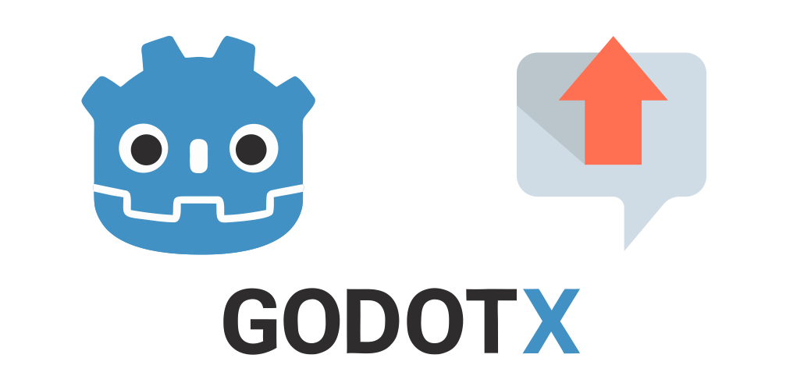

<p align="center">
    <a href="https://github.com/godot-x/label-up-x" target="_blank" rel="noopener noreferrer">
        
    </a>
</p>

# LabelUpX

A high-performance floating text system for Godot 4.5+ (2D) designed for damage numbers, heals, XP, gold, combos, and any animated floating text. Built to sustain **10,000+ simultaneous labels** with zero frame spikes and no memory leaks.

## Features

- **Global API**: `LabelUpX.show(position, text, style)` and `LabelUpX.show_xy(x, y, text, style)`
- **Object pool**: Pre-allocated nodes, no runtime allocation after warmup
- **Style-driven**: Every visual and animation is configurable via `LabelUpXStyle` (Resource)
- **Built-in styles**: Default, Damage, Critical, Heal, XP, Gold, Fire, Ice, Poison
- **Movement**: 10 directions (UP, DOWN, RANDOM, etc.), distance, duration, easing, optional Curve
- **Motion styles**: Straight, Arc, Wiggle, Shake, Scale up, Scale down
- **Appear**: Fade, scale, pop, scale-and-fade
- **Exit**: None, fade out, scale out, or scale and fade
- **Stacking & jitter**: Spawn offset and random jitter when multiple labels spawn at the same position
- **Optional follow target**: Style can attach to a Node2D with offset; safe if target is freed
- **Signals**: `label_spawned(id)`, `label_finished(id)`
- **2D only**: No 3D; production-grade, no deprecated APIs

## Installation

1. Copy the `addons/label_up_x` folder into your Godot project.
2. Enable the plugin in **Project → Project Settings → Plugins**.
3. The plugin registers `LabelUpX` as an autoload singleton.

## Basic Usage

```gdscript
# By position
var id = LabelUpX.show(Vector2(100, 200), "42", LabelUpXStyles.get_instance().get_style(LabelUpXStyles.DAMAGE))

# By x, y
var id = LabelUpX.show_xy(100.0, 200.0, "+50 XP", LabelUpXStyles.get_instance().get_style(LabelUpXStyles.XP))

# Control
LabelUpX.dismiss(id)
LabelUpX.clear_all()

# Pool
LabelUpX.prewarm(500)
var active = LabelUpX.get_active_count()
var pool_size = LabelUpX.get_pool_size()
```

## API Reference

### Main methods

| Method | Description |
|--------|-------------|
| `LabelUpX.show(position: Vector2, text: String, style: LabelUpXStyle) -> int` | Spawn a floating label; `position` is the **center** of the label. Returns unique id or -1. |
| `LabelUpX.show_xy(x: float, y: float, text: String, style: LabelUpXStyle) -> int` | Same as `show` with x, y. |
| `LabelUpX.dismiss(id: int) -> bool` | Dismiss one label by id and return it to the pool. |
| `LabelUpX.clear_all()` | Dismiss all active labels. |
| `LabelUpX.prewarm(amount: int)` | Pre-allocate pool nodes (default prewarm is 200). |
| `LabelUpX.get_active_count() -> int` | Number of labels currently visible. |
| `LabelUpX.get_pool_size() -> int` | Total pool size (active + available). |

### Signals

```gdscript
LabelUpX.label_spawned.connect(func(id): ...)
LabelUpX.label_finished.connect(func(id): ...)
```

### Validation

- Empty `text` → `push_error` and returns -1.
- Null `style` → `push_error` and returns -1.
- No silent fallbacks.

## Pooling

- **Prewarm**: Call `LabelUpX.prewarm(amount)` at startup (e.g. 200–500). Default prewarm is 200.
- **Reuse**: When a label finishes its animation (or is dismissed), it is reset and returned to the pool.
- **Growth**: If the pool is empty and growth is allowed, a new node is created. You can configure the pool to drop the oldest label instead when at capacity.
- **No `queue_free`**: Labels are never freed during gameplay; they are only reset and reused.

## Performance (10k+ labels)

- **Fonts**: Use the same Font resource in styles; do not create new Font instances per label.
- **Materials**: Reuse `CanvasItemMaterial` in styles when needed.
- **No per-frame allocation**: No new objects in `_process`, no string concatenation in hot paths, no dynamic arrays per spawn.
- **Tweens**: One-shot tweens per label; no lambdas that allocate.
- **Pool**: Prewarm to your expected peak (e.g. 500–1000). For 10k stress tests, allow pool growth or drop-oldest so the game doesn’t allocate in a burst.

## Custom style

Create a `LabelUpXStyle` resource (or duplicate a built-in one):

```gdscript
var style = LabelUpXStyle.new()
style.font_size = 28
style.font_color = Color.GOLD
style.movement_direction = LabelUpXEnums.MovementDirection.UP
style.duration = 1.2
style.distance = 80.0
style.motion_style = LabelUpXEnums.MotionStyle.SCALE_UP
style.appear_animation = LabelUpXEnums.AppearAnimation.POP
style.exit_animation = LabelUpXEnums.ExitAnimation.FADE_OUT
# ... outline, follow_target, initial_scale, final_scale, etc.

LabelUpX.show(position, "Custom!", style)
```

You can also save `.tres` resources and load them:

```gdscript
var style = load("res://my_styles/critical.tres") as LabelUpXStyle
LabelUpX.show(pos, "999!", style)
```

## Demo and stress testing

Open **scenes/demo/label_up_x_demo.tscn** and run the project.

- **Stress Test**: “Spawn 10,000 Labels” to verify FPS and pool; “Clear All” to clear.
- **Style Showcase**: Buttons for each built-in style; sliders for duration, distance, font size, outline, scale; motion and exit animation dropdowns; click area to spawn.
- **World Example**: Click in the panel to spawn damage numbers; enable “Follow target” to spawn on the character (Node2D) so labels follow it.

## Best practices for 10k usage

1. **Prewarm** at startup: `LabelUpX.prewarm(500)` or higher for heavy screens.
2. **Reuse styles**: Use `LabelUpXStyles.get_style(...)` or shared `.tres` resources; avoid creating new `LabelUpXStyle` instances every spawn.
3. **Reuse fonts**: Assign one Font (or theme font) in your style; do not create new Font instances per label.
4. **Limit spawn rate** if needed (e.g. cap damage numbers per frame) so the pool doesn’t grow unbounded.
5. Use **dismiss(id)** or **clear_all()** when changing scenes or closing UIs to return labels to the pool.

## Screenshot

https://github.com/user-attachments/assets/7ceacff4-30fe-4698-b7fc-6ccee16691f6

## License

This project is licensed under the [MIT License](LICENSE).

---

Made with ❤️ by Paulo Coutinho
